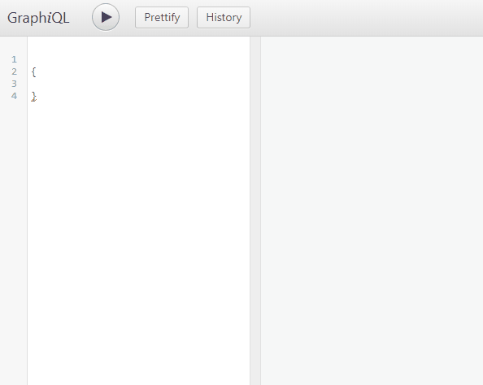
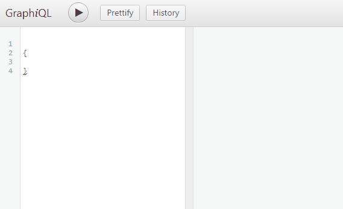

# Swarm Server

Swarm Server provides a service for sharing information obtained during debugging sessions, providing interactive and real-time visualization techniques, and several searching tools. [Swarm Debugging](https://lume.ufrgs.br/handle/10183/150176#)

## Requirements

-[docker-compose](https://docs.docker.com/compose/install/)

## How to Run

1. build with Gradle
2. build with docker-compose
3. run with docker-compose

```bash
./gradlew build
docker-compose build
docker-compose up
```

## Usage

Using GraphiQL for testing

@localhost:8080/graphiql






Can also be used with :
-[SwarmManager](https://github.com/SwarmDebugging/SwarmManager) Eclipse plug-in
-HTTP REST requests at localhost:8080
-HTTP requests at localhost:8080/graphql? endpoint
